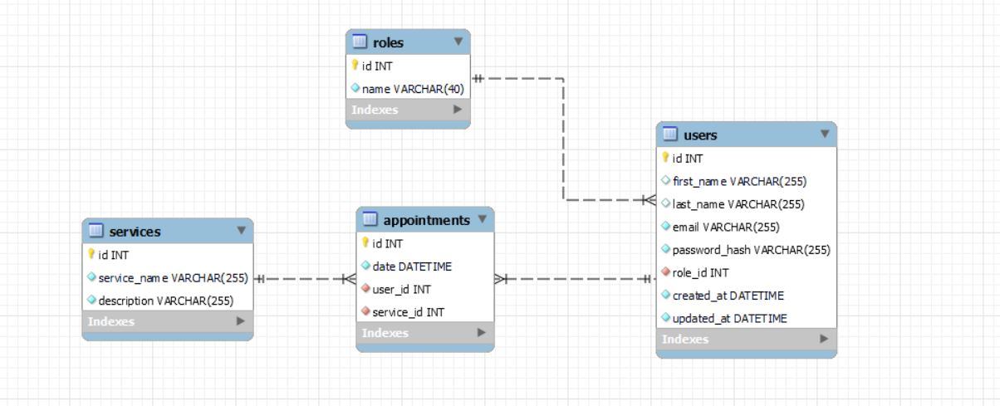

# TattooShop Backend🖋️
<br>
<a>

</a>
<br><br>

<details>
  <summary>Table of Contents📝</summary>
  <ol>
    <li><a href="#description">Description</a></li>
    <li><a href="#objetive">Objetive</a></li>
    <li><a href="#deploy-🚀">Deploy</a></li>
    <li><a href="#stack">Stack</a></li>
    <li><a href="#diagram-bd">Diagram</a></li>
    <li><a href="#local-installation">Local installation</a></li>
    <li><a href="#endpoints">Endpoints</a></li>
    <li><a href="#future-functionalities">Future functionalities</a></li>
    <li><a href="#webgrafia">Webgrafia</a></li>
    <li><a href="#appreciations">Appreciations</a></li>
    <li><a href="#contact">Contact</a></li>
  </ol>
</details>
<br>

## Description📚
This project consists of the recreation of a tattoo studio in which users will be able to register in the application, log in and access their personal area. Within their area, they will be able to view a list of scheduled appointments for tattoo and piercing services, as well as create new appointments for various services offered by the studio, such as:

- **Custom Tattoos**:
Clients will have the freedom to select unique motifs and designs, completely customizing their tattoo experience according to their preferences and tastes.
- **Tattoos from the catalog**:
We offer tattoos based on predefined designs in our catalog. Customers can choose from a variety of stylish and proven options.
- **Restoration and rejuvenation of works**:
We specialize in the restoration and rejuvenation of existing tattoos. Our experts work to improve and renew old tattoos, restoring their vitality.
- **Placement of piercings and dilators**: 
We offer professional services for the placement of piercings and dilators. Our team ensures safe procedures and varied styles to meet individual preferences of our clients.
- **Sale of piercings and other items**:
In addition to our application services, we offer a selection of piercings and other body art related items. Customers can purchase quality products for complement your unique style.

## Objetive🎯
The objective of this project is to adapt to the work done by TypeScript together with relational databases and learn to get along with Express JS, Node, Bcrypt and Jsonwebtoken. 
With the tools I just mentioned, I have completed a list of endpoints, migrations, models and seeders, taking into account different roles with their respective permissions.

## Deploy 🚀
<div align="center">
    <a href="https://www.google.com"><strong>Url a producción </strong></a>🚀🚀🚀
</div>

## Stack
Used technology:
<div align="center">
<a>
    
</a>
<a>
    
</a>
<a>
    
</a>
<a>
    
</a>
<a>
    
</a>
<a>

</a>
<a>
    
</a>
<a>
    
</a>
</div>


## Diagram BD


## Local installation
1. Clone the repository:
2. ` $ npm install `
3. We connect our repository with the database: 
4. ``` $ Ejecutamos las migraciones ``` 
5. ``` $ Ejecutamos los seeders ``` 
6. ``` $ npm run dev ``` 
7. ...

## Endpoints
<details>
<summary>Authentication</summary>

- Register user

          POST http://localhost:4000/api/register

    body:

    ```js
        {
            "email": "david@david.com",
            "password": "123456789"
        }
    ```

- Login user	

          POST http://localhost:4000/api/login

    body:

    ```js
        {
            "email": "david@david.com",
            "password": "123456789"
        }
    ```
</details>
<details>
<summary>Users</summary>

- View all users

          GET http://localhost:4000/api/users

    auth:

    ```js
        your token
    ```

- View user profile

          GET http://localhost:4000/api/users/profile

    auth:

    ```js
        your token
    ```
- Update user profile

          PUT http://localhost:4000/api/profile/update/:id

    auth:

    ```js
        your token
    ```

    body:

    ```js
        {
            info you want to change goes here
        }
    ```
</details>
<details>
<summary>Services</summary>


</details>
<details>
<summary>Appointments</summary>


</details>

## Future functionalities
[ ] Add the tattoo artists table
[ ] Implement migration, model and role controller.


## Webgrafia:
To achieve my goal I have collected information from:


## Appreciations:

I would like to dedicate my thanks to the teachers at Geeks Hubs as well as my day to day colleagues with whom we can help each other with our problems.


## Contact
- **David Fernandez Valle**
  - [GitHub](https://github.com/Davfernandezz)
